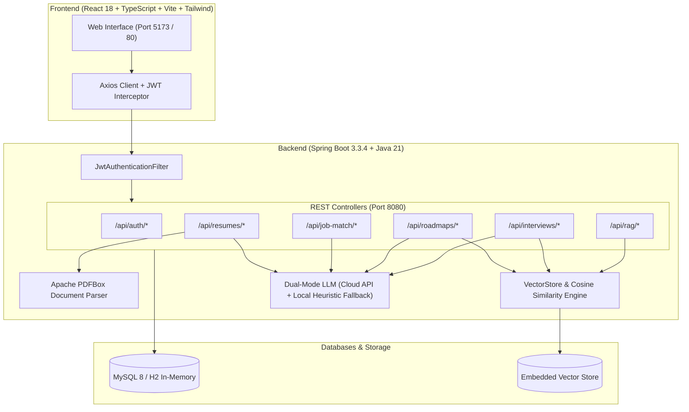

# AI Career Copilot — Full-Stack AI Career Platform

[](https://spring.io/projects/spring-boot)
[](https://www.oracle.com/java/)
[](https://reactjs.org/)
[](https://www.typescriptlang.org/)
[](https://tailwindcss.com/)
[](https://www.docker.com/)

A production-style AI career platform built with **Java, Spring Boot 3, React TypeScript, MySQL, Retrieval-Augmented Generation (RAG), Apache PDFBox document processing, and JWT authentication**.

---

## Key Highlights & Features

1. **AI Resume & ATS Scoring Analyzer**
   - Extracts structured text from multi-page PDFs using **Apache PDFBox 3.x** or raw markdown.
   - Calculates a weighted **ATS Compatibility Score (0-100%)**, Impact Score (action verbs + quantifiable metrics density), and Formatting/Section Hierarchy Score.
   - Automatically detects weak bullets and converts them to **STAR-formula** accomplishments with quantifiable business results.

2. **Job Description Matching & Skill Gap Matrix**
   - Compares candidate profile and resume text against any target job requisition.
   - Visualizes matched competencies vs. missing skill gaps.
   - Generates an AI-tailored elevator pitch and cover letter excerpt.

3. **Personalized Career Roadmaps**
   - Synthesizes phased milestone progressions (e.g. Core Foundations, Distributed Systems, Cloud Containers, High-Level System Design).
   - Provides interactive milestone checklists and curated engineering reading lists.

4. **Interactive Technical Mock Interview Simulator**
   - Real-time technical interview room tailored to target roles and seniority levels (Entry, Mid, Senior, Lead).
   - AI rubric grading evaluating technical depth, edge cases, and terminology.
   - Provides staff-level reference answers and readiness summaries.

5. **RAG Vector Knowledge Base & Engine**
   - Embedded dense semantic vector engine utilizing **Cosine Similarity** over normalized embeddings.
   - Curated knowledge base containing engineering benchmarks, ATS rubrics, and system design rubrics.
   - Augments prompts with top-k contextual chunks.

6. **Stateless JWT Security & Persistence**
   - Spring Security 6 with stateless filter chain and BCrypt password encryption.
   - Multi-database support: **MySQL 8.0** for Docker/production and **H2** for instant zero-dependency local runs.

---

## System Architecture



---

## Project Structure

```
ai-career-copilot/
├── backend/
│   ├── src/main/java/com/aicopilot/
│   │   ├── config/             # Spring Security, JWT Service & Filter, CORS, RAG Seeder
│   │   ├── controller/         # Auth, Resumes, JobMatch, Roadmaps, Interviews, RAG
│   │   ├── dto/                # Request & Response contracts
│   │   ├── model/              # JPA Entities (User, Resume, JobMatch, Roadmap, Interview, RAG)
│   │   ├── repository/         # Spring Data JPA Repositories
│   │   └── service/            # Core business logic, PDFBox parser, Vector cosine search, LLM
│   ├── src/main/resources/     # application.yml, application-h2.yml, application-mysql.yml, RAG data
│   ├── pom.xml                 # Maven configuration (Java 21, Spring Boot 3.3, PDFBox 3, JJWT 0.12)
│   └── Dockerfile              # Multi-stage production container build
├── frontend/
│   ├── src/
│   │   ├── api/                # Axios instance with Bearer JWT interceptors
│   │   ├── components/         # Navbar, ScoreGauge, Ambient background
│   │   ├── context/            # AuthContext (state, tokens, 1-click demo login)
│   │   ├── pages/              # Dashboard, ResumeAnalyzer, JobMatcher, CareerRoadmap, MockInterview, RAG
│   │   ├── types/              # Full TypeScript definitions
│   │   ├── App.tsx             # Main layout & router tabs
│   │   └── main.tsx            # React root
│   ├── package.json
│   ├── vite.config.ts
│   ├── Dockerfile
│   └── nginx.conf
├── docker-compose.yml          # Unified multi-container deployment (MySQL + Backend + Frontend)
├── run-local.bat               # Windows 1-click launcher
├── run-local.ps1               # PowerShell launcher
├── .env.example                # Environment variables template
└── README.md
```

---

## Quick Start (Run Locally in 2 Minutes)

### Prerequisites
- **Java 21 or 25**
- **Maven 3.8+**
- **Node.js 18+ & npm**

### 1. Start the Backend
```bash
mvn -f backend/pom.xml spring-boot:run
```
*The backend boots on `http://localhost:8080` with pre-seeded RAG knowledge documents and a demo account.*

### 2. Start the Frontend
```bash
npm.cmd --prefix frontend install
npm.cmd --prefix frontend run dev
```
*The frontend boots on `http://localhost:5173`.*

### 3. Verify the Build
```bash
mvn -f backend/pom.xml test
npm.cmd --prefix frontend run build
```
The local profile uses H2 and does not require MySQL or an external LLM key. Set `JWT_SECRET`, `CORS_ALLOWED_ORIGINS`, and the database variables from `.env.example` for deployment.

### 4. Demo Login Credentials
For instant 1-click testing without manual signup:
- Click the **"1-Click Demo"** button on the Navbar, OR enter:
  - **Email:** `demo@aicopilot.com`
  - **Password:** `password123`

---

## Docker & Cloud Deployment

To launch the entire platform with MySQL 8.0, Backend, and Frontend containers:

```bash
docker-compose up --build -d
```

| Service | Container Name | URL / Port |
| :--- | :--- | :--- |
| **Frontend UI** | `aicopilot-frontend` | `http://localhost` (Port 80) |
| **Backend REST API** | `aicopilot-backend` | `http://localhost:8080` |
| **MySQL Database** | `aicopilot-mysql` | `localhost:3306` |

---

## REST API Specification

| Method | Endpoint | Description | Protected |
| :--- | :--- | :--- | :---: |
| `POST` | `/api/auth/register` | Register new candidate account | No |
| `POST` | `/api/auth/login` | Authenticate & receive Bearer JWT token | No |
| `GET` | `/api/auth/me` | Fetch authenticated user profile | Yes |
| `POST` | `/api/resumes/upload` | Upload PDF/TXT resume for ATS evaluation | Yes |
| `POST` | `/api/resumes/analyze-text`| Analyze raw text resume | Yes |
| `GET` | `/api/resumes` | Retrieve user resume history | Yes |
| `POST` | `/api/job-match/analyze` | Run resume vs. JD gap analysis | Yes |
| `POST` | `/api/roadmaps/generate` | Generate phased learning roadmap | Yes |
| `POST` | `/api/interviews/start` | Start interactive mock interview session | Yes |
| `POST` | `/api/interviews/submit`| Submit answer for real-time AI scoring | Yes |
| `POST` | `/api/rag/search` | Query semantic vector store with Cosine metric | No |
| `POST` | `/api/rag/ask` | Ask career question with RAG augmentation | Yes |
| `POST` | `/api/rag/ingest` | Ingest custom career document into vector store | Yes |
